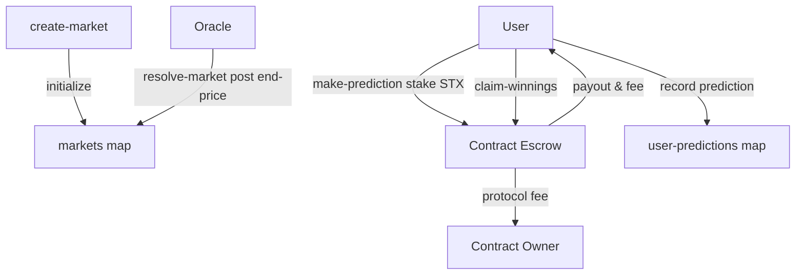

# OracleStrike – Bitcoin Price Prediction Markets

OracleStrike is a **decentralized prediction-market protocol** built on [Stacks](https://stacks.co/), enabling users to speculate on **Bitcoin price movements** by staking STX tokens.
It combines the security of Bitcoin settlement with the programmability of Clarity smart contracts to deliver **transparent, automated, and fair** prediction markets.

---

## 🚀 System Overview

| Role / Actor       | Purpose                                                                             |
| ------------------ | ----------------------------------------------------------------------------------- |
| **Market Creator** | Deploys new markets with initial BTC price, start block, and end block.             |
| **Participant**    | Stakes STX tokens on bullish (“up”) or bearish (“down”) price movements.            |
| **Oracle**         | Publishes final BTC price after market closure to resolve outcomes.                 |
| **Protocol**       | Holds funds in escrow, calculates rewards, and distributes winnings proportionally. |

**Lifecycle**

1. **Market Creation** – Owner deploys a new market specifying start price, start block, end block.
2. **Prediction Phase** – Users stake STX on “up” or “down” while market is open.
3. **Resolution** – Oracle posts final BTC price. Contract marks winning side.
4. **Claiming Rewards** – Winning participants claim their proportional STX payout minus protocol fee.

---

## 📐 Contract Architecture

The Clarity contract implements the following main components:

| Module / Area           | Description                                                                                                                                                                                                                                                                                                                                      |
| ----------------------- | ------------------------------------------------------------------------------------------------------------------------------------------------------------------------------------------------------------------------------------------------------------------------------------------------------------------------------------------------ |
| **Error Constants**     | Standardized error codes for permission, parameter, and lifecycle validation.                                                                                                                                                                                                                                                                    |
| **Data Variables**      | Oracle address, minimum stake requirement, platform fee percentage, market counter.                                                                                                                                                                                                                                                              |
| **Maps**                | - `markets` for per-market state (prices, stakes, timing, resolution).<br>- `user-predictions` for individual participant stakes and claim status.                                                                                                                                                                                               |
| **Public Functions**    | - `create-market` – Create new prediction market.<br>- `make-prediction` – Stake STX on “up”/“down”.<br>- `resolve-market` – Oracle resolves market with final BTC price.<br>- `claim-winnings` – Winning participants claim STX rewards.<br>- Admin setters (`set-oracle-address`, `set-minimum-stake`, `set-fee-percentage`, `withdraw-fees`). |
| **Read-only Functions** | Market and user getters (`get-market`, `get-user-prediction`, `get-contract-balance`, etc.).                                                                                                                                                                                                                                                     |

### Key Features

* **Binary Prediction Markets** (up vs down).
* **Proportional Reward Distribution** – Winnings distributed by stake weight.
* **Oracle-Driven Price Resolution** – Integrity and automation.
* **Dynamic Fee Structure** – Platform fee configurable.
* **Block-Height Lifecycle Triggers** – Market phases tied to Stacks block height.
* **Multi-Layered Security** – Escrowed funds, permissions, and invariant checks.

---

## 🗂 Data Flow



---

## ⚙️ Installation & Deployment

1. **Clone repository**

   ```bash
   git clone https://github.com/your-org/oraclestrike.git
   cd oraclestrike
   ```

2. **Review / update constants**

   * `contract-owner`
   * Initial `oracle-address`, `minimum-stake`, `fee-percentage`.

3. **Deploy contract** using [Clarinet](https://docs.hiro.so/clarinet):

   ```bash
   clarinet deploy
   ```

4. **Test locally**

   ```bash
   clarinet test
   ```

---

## 📝 Public Interface Summary

| Function                                             | Type           | Description                                     |
| ---------------------------------------------------- | -------------- | ----------------------------------------------- |
| `create-market(start-price, start-block, end-block)` | Public         | Creates a new BTC price prediction market.      |
| `make-prediction(market-id, prediction, stake)`      | Public         | Stake STX on bullish/bearish movement.          |
| `resolve-market(market-id, end-price)`               | Public         | Oracle posts final BTC price.                   |
| `claim-winnings(market-id)`                          | Public         | Claim proportional reward from resolved market. |
| `get-market(market-id)`                              | Read-only      | Retrieve market state.                          |
| `get-user-prediction(market-id, user)`               | Read-only      | Retrieve individual prediction info.            |
| `get-contract-balance()`                             | Read-only      | STX held in escrow.                             |
| `set-oracle-address(new-address)`                    | Public (Owner) | Update oracle principal.                        |
| `set-minimum-stake(new-minimum)`                     | Public (Owner) | Update minimum stake requirement.               |
| `set-fee-percentage(new-fee)`                        | Public (Owner) | Update platform fee percentage.                 |
| `withdraw-fees(amount)`                              | Public (Owner) | Withdraw accumulated platform fees.             |

---

## 🔐 Security Considerations

* Funds escrowed in contract until resolution.
* Only designated oracle can resolve market.
* All setter and withdraw functions gated to `contract-owner`.
* Parameter checks prevent zero/invalid stakes and price values.

---

## 📄 License

Specify your license here (e.g., MIT).

---

## 🤝 Contributing

Contributions are welcome. Please open an issue or PR to propose improvements or bug fixes.
